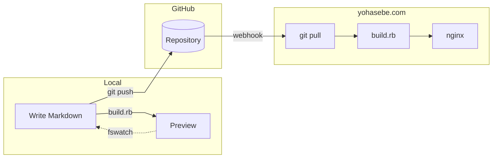

# yohasebe.com

Source repository for [yohasebe.com](https://yohasebe.com) -- a personal blog about linguistics, software, music, and other interests.

## How it works

## Tech stack

- **Generator**: Custom Ruby script ([`scripts/build.rb`](scripts/build.rb))
- **Markdown**: kramdown + GFM + Rouge (syntax highlighting) + KaTeX (math)
- **Search**: Client-side full-text search (inverted index built at build time)
- **Deploy**: Automated via GitHub webhook

## License

Text content is licensed under [CC BY-ND 4.0](https://creativecommons.org/licenses/by-nd/4.0/).
