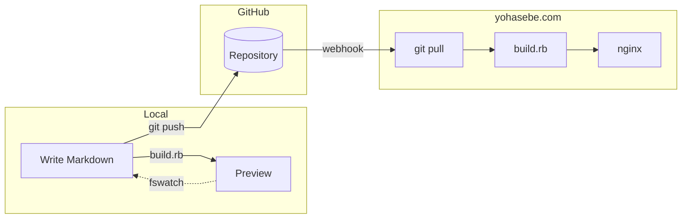

# yohasebe.com

Source repository for [yohasebe.com](https://yohasebe.com) -- a personal blog about linguistics, software, music, and other interests.

## Recent posts

<!-- recent-posts:start -->
- 2026-04-25 -- [Watching Words Appear: Real-time STT and L2 Listening](https://yohasebe.com/posts/2026-04-25-speechdock-listening-mirror/)
- 2026-04-25 -- [Filing in Trees, Finding in Fragments](https://yohasebe.com/posts/2026-04-25-fzf-alfred-workflow/)
- 2026-04-21 -- [Monadic Chat: Expressive Speech](https://yohasebe.com/posts/2026-04-21-expressive-speech/)
- 2026-04-18 -- [TCSE: A Fullscreen Mode for Listening Practice](https://yohasebe.com/posts/2026-04-18-tcse-fullscreen/)
- 2026-04-13 -- [What "Monadic" in Monadic Chat Means](https://yohasebe.com/posts/2026-04-13-monadic-chat-name/)
- 2026-04-12 -- [Whisper Stream: A Unix Building Block for Speech](https://yohasebe.com/posts/2026-04-12-whisper-stream/)
- 2026-04-11 -- [TCSE: Exporting Search Results](https://yohasebe.com/posts/2026-04-11-tcse-export/)
- 2026-04-08 -- [AI Reviewed My Guitar Solo](https://yohasebe.com/posts/2026-04-08-gemini-guitar-review/)
- 2026-04-07 -- [Paradocs: Sentence-by-Sentence Presentations](https://yohasebe.com/posts/2026-04-07-paradocs/)
- 2026-04-06 -- [RSyntaxTree: Left-to-Right Trees](https://yohasebe.com/posts/2026-04-06-rsyntaxtree-ltr/)
<!-- recent-posts:end -->

## How it works

## Tech stack

- **Generator**: Custom Ruby script ([`scripts/build.rb`](scripts/build.rb))
- **Markdown**: kramdown + GFM + Rouge (syntax highlighting) + KaTeX (math)
- **Search**: Client-side full-text search (inverted index built at build time)
- **Deploy**: Automated via GitHub webhook

## License

Text content is licensed under [CC BY-ND 4.0](https://creativecommons.org/licenses/by-nd/4.0/).
