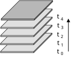
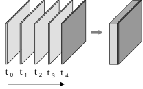
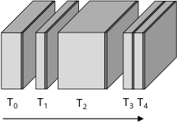
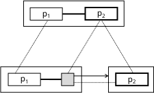

Speakers build meaning by stacking utterances one after another. Content too complex for a single word or sentence takes shape in the listener's mind through a chain of utterances. This process bears a close resemblance to the "monad", a structure well known in functional programming. The "stack-based structure model of discourse", published in *Ninchi Gengogaku Ronkou* (Studies in Cognitive Linguistics, vol. 18), uses this resemblance as a point of departure for describing how meaning is constructed in discourse.

## Linearity and the constraints of memory

A fundamental property of natural language is linearity. Speakers and listeners process utterances sequentially along a timeline. Yet the meaning structures that emerge from this linear process are far larger and more complex than any individual utterance.

This sequential process is subject to memory constraints. Human working memory is often estimated to hold around four chunks of information at once. Concepts introduced early gradually lose activation and recede into the background. They do not disappear entirely, however; later utterances can reactivate them.

Ronald Langacker, who developed Cognitive Grammar, described this process as a chain of "windows of attention" (Langacker 2001). My proposal builds on this by capturing the conceptual structures created by these windows as "stacked layers."

As discourse progresses in time, new layers accumulate on top of older ones. Recent layers retain high activation, while older layers gradually fade. This maps naturally onto a FILO (first-in-last-out) stack structure.

## Utterances as monads

Here I introduce the concept of a monad from functional programming. A monad is a structure that wraps values in a context and chains operations while preserving that context. Its two basic operations are:

$$\text{return}: a \to M(a)$$

$$\text{bind}: M(a) \to (a \to M(b)) \to M(b)$$

$\text{return}$ wraps a value in a context; $\text{bind}$ applies a function to a value-in-context and produces a new value-in-context.

Utterances in discourse appear to share structural similarities with monads. Each utterance $u_t$ takes the preceding discourse context $C_{t-1}$ as input and outputs an extended context $C_t$:

$$C_t = u_t(C_{t-1})$$

The process of a single utterance activating concepts and introducing them into the discourse space can be seen as analogous to $\text{return}$. The process of building on the conceptual structure of a preceding utterance to introduce new concepts can be seen as analogous to $\text{bind}$. Each utterance behaves not as an independent sentence but as a function that receives a context and returns an enriched one. Each layer of the stack is the result of this incremental context extension.

## Unitization and chaining

Another important property of the stack-based structure is that multiple layers can be bundled into a single "discourse unit."

The layers accumulated from $t_0$ through $t_4$ are all projected onto the final structure at $t_4$, forming a cohesive whole. This can be viewed as analogous to monadic composition:

$$D = u_1 \gg\!= u_2 \gg\!= \cdots \gg\!= u_n$$

Individual monadic values (utterances) chain together to form a larger monadic value (a discourse unit).

This unitization involves collapsing nested conceptual structures into a single context. Without an operation analogous to monadic join ($M(M(a)) \to M(a)$), layers would grow ever deeper and the structure would become unmanageable. In an earlier study (Hasebe 2021), I called this process "proposition folding": once a relationship between two propositions is established, the composite structure can be treated as a single proposition available for subsequent retrieval.

These unitized structures then become elements of further chaining, composing larger stretches of discourse.

Each discourse unit ($T_0$, $T_1$, ...) contains a stack-based structure internally while itself functioning as an element of a stack-based structure at a larger scale. This can be seen as a form of recursive monadic composition. A presentation at the International Cognitive Linguistics Conference (Hasebe 2023) explored this recursive architecture in more detail.

## Discourse connectives: controlling contextual chaining

What most closely resembles the monadic $\text{bind}$ operation is the discourse connective. Words like *because*, *so*, and *but* explicitly specify how the conceptual structure built by a preceding proposition $p_1$ should unfold toward a following proposition $p_2$.

> It was raining. *So* the game was cancelled.

Formally, the role of a connective can be written as:

$$\text{conn}: M(p_1) \to (p_1 \to M(p_2)) \to M(p_1 \oplus p_2)$$

The connective takes the preceding conceptual structure $M(p_1)$, applies an expansion function from $p_1$ to $p_2$, and produces an integrated structure $M(p_1 \oplus p_2)$. This parallels the type signature of $\text{bind}$.

Within the framework of Langacker's Cognitive Grammar (Langacker 2008), the conceptual structure of a connective can be diagrammed as follows:

The lower level represents the connective's own conceptual structure. $p_1$ on the left is the antecedent; the box on the right is a slot to be filled by $p_2$. When the connective is uttered, the concept expressed by $p_1$ becomes a reference point, opens a search domain, and signals that another relational concept $p_2$ will be positioned as a target within that domain. When $p_2$ is uttered, the composite structure shown at the upper level is obtained.

## From linear input to structured meaning

The reach of the stack-based model extends beyond linguistics. In the Transformer architecture used by large language models, self-attention computes relationships among all elements in an input sequence. Analyses of trained models have found that many attention heads concentrate on nearby tokens, and architectures that explicitly model attention decay over distance have proved effective. This locality bias resembles the gradual decay of activation in the stack-based model.

Human cognitive processes and neural network computations are fundamentally different. But it is suggestive that both arrive at similar solutions to the shared problem of building structured meaning from linear input. The mathematical structure of the monad might serve as a language for describing what they have in common.

---

Hasebe, Y. 2021. An Integrated Approach to Discourse Connectives as Grammatical Constructions. Doctoral dissertation, Kyoto University. [DOI](https://doi.org/10.14989/doctor.k22900)

Hasebe, Y. 2023. Redefining the Current Discourse Space Model as a Recursive Monadic Architecture. The 16th International Cognitive Linguistics Conference. [PDF](assets/docs/iclc16-hasebe-2023.pdf)

Hasebe, Y. 2025. A stack-based structure model of discourse: linearity and the unfolding of conceptual structure [in Japanese]. *Ninchi Gengogaku Ronkou* (Studies in Cognitive Linguistics) 18, 269-309. Tokyo: Hituzi Syobo.

Langacker, R. W. 2001. Discourse in Cognitive Grammar. *Cognitive Linguistics* 12(2), 143-188.

Langacker, R. W. 2008. *Cognitive Grammar: A Basic Introduction*. Oxford: Oxford University Press.
