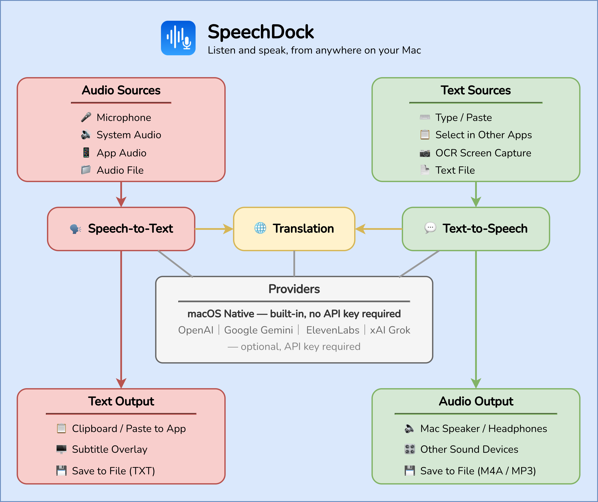

I released [SpeechDock](https://github.com/yohasebe/speechdock), a macOS menu bar application for practical speech processing. It handles text-to-speech, speech-to-text, and translation, and sits in the menu bar so it is always accessible.

**Multiple providers**

SpeechDock supports several TTS and STT providers through their web APIs: OpenAI (Whisper, GPT-4o), Google Gemini, ElevenLabs, and Grok. You can switch between providers depending on your needs.

**macOS native features**

For those who prefer to keep data on-device, SpeechDock also works with macOS built-in speech recognition, text-to-speech, OCR, and translation. No API keys are needed for these, which makes it a good option when privacy matters.

**Real-time subtitles**

One feature I find particularly useful is live subtitle overlay. SpeechDock can capture system audio or the audio from a specific app, transcribe it in real time, and display subtitles on screen. Combined with the translation feature, this works for following online meetings or watching videos in other languages. The subtitles are customizable in font size, opacity, and position.

It also supports screenshot OCR to speech, a floating mic button for quick transcription, AppleScript automation, and global keyboard shortcuts. The app is open source under the Apache 2.0 license.

