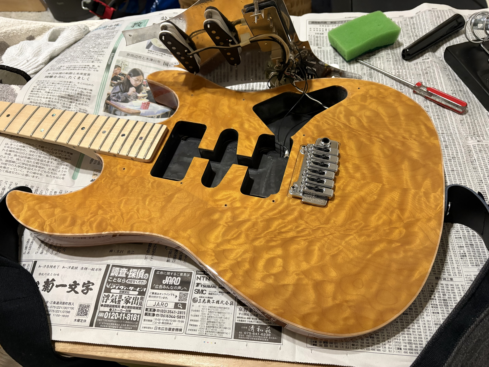

After the [live event in February](../2026-02-01-cover-band-live/index.html), I was unhappy with my guitar tone. My guitar is a Fujigen Expert OS (EOS), a semi-custom Strat-type with an SSH pickup configuration. The output was just too low. With my Boss GX-10 multi-effects unit, I had to boost the input level by +7 to 8 dB just to reach a proper signal level. Coming from a hard rock and metal background, I have never learned to work well with low-output pickups. There is a rear pickup direct switch that bypasses the volume and tone pots, but even with that engaged, the output was weak. The tone had a wide range but lacked the focus I wanted. I had sensed this myself, but when other band members pointed it out during rehearsal, it became impossible to ignore.

For the upcoming cover session in March, I needed a single-coil-like crunch tone on the bridge pickup for some Thee Michelle Gun Elephant songs. That meant coil splitting.

After some research, I ordered a set of Suhr pickups (V63 for neck and middle, SSH+ for bridge) that seemed like a good match for the EOS, with higher output. I decided to install them myself.

I picked up a soldering iron for the first time in years and struggled through swapping all three pickups. It took a long time and I burned myself. The wiring was messy, and I must have left some solder debris inside, because the guitar rattled when I shook it. But it made sound, the volume was noticeably higher, the mids had more punch, and I thought things were looking good.

A few days later, I noticed a problem. Plugging straight into an amp produced so much noise that playing was impossible. I had not caught it earlier because my wireless system (Boss WL-50) somehow masked the issue. I had no idea what was causing it, and the thought of redoing the wiring was unbearable. But the session was tomorrow, and I had six songs to play with this guitar.

In desperation, I called a guitar repair shop in Nara that I had visited once before, and asked if he could take a look. He made time for me, so I drove over immediately. It turned out there was a redundant wire that I had left connected. He removed it, touched up the questionable solder joints, vacuumed out the cavity, and tested the output. The noise was gone. The rattling was gone.

The whole thing took about an hour, and I was genuinely relieved. It is good to try new things, but some things are best left to the professionals.
