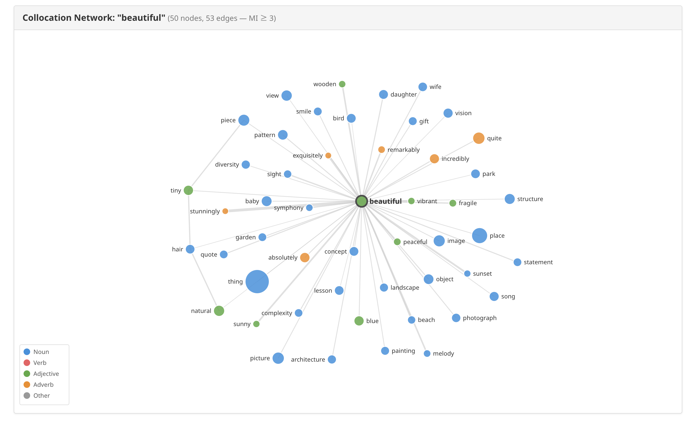

This post introduces the collocation network feature I built into [TCSE](https://yohasebe.com/tcse), covering the statistical measures behind it and a real visualization example.

## What is collocation?

A collocation is a pair of words that co-occur more often than chance would predict. "Make a decision" sounds natural while "do a decision" does not -- collocation is the concept that lets us quantify this kind of bond between words.

## Statistical measures

TCSE uses three statistical measures to assess collocation strength. The formulas below use the notation of a 2x2 contingency table:

|  | Word 2 present | Word 2 absent | Total |
|--|----------------|---------------|-------|
| **Word 1 present** | $O_{11}$ | $O_{12}$ | $R_1$ |
| **Word 1 absent** | $O_{21}$ | $O_{22}$ | $R_2$ |
| **Total** | $C_1$ | $C_2$ | $N$ |

$O_{11}$ is the observed co-occurrence frequency of the two words, $R_1$ and $C_1$ are the individual frequencies of each word, and $N$ is the total number of tokens in the corpus.

### Mutual Information (MI)

$$MI = \log_2 \frac{O_{11} \cdot N}{R_1 \cdot C_1}$$

MI expresses, on a logarithmic scale, how much the observed co-occurrence exceeds what we would expect under independence. Higher values indicate stronger association.

A known weakness of MI is that it tends to overestimate the strength of low-frequency pairs. To compensate, we use t-score alongside it.

### t-score

$$t = \frac{O_{11} - E_{11}}{\sqrt{O_{11}}}$$

where $E_{11} = \frac{R_1 \cdot C_1}{N}$ is the expected frequency under independence. t-score is better suited for detecting high-frequency, stable collocations.

### Difference of Proportions (DP)

$$DP = \frac{O_{11}}{R_1} - \frac{C_1 - O_{11}}{N - R_1}$$

This takes the difference between the rate at which the collocate appears in the context of the target word and its rate elsewhere. It is intuitive to interpret and can be read as an effect size.

## Visualization: the network for "beautiful"

Below is the collocation network generated by searching for "beautiful" in TCSE (filtered at MI >= 3, 50 nodes).

Node color represents part of speech: nouns (blue), verbs (red), adjectives (green), adverbs (orange). Node size is proportional to co-occurrence frequency.

Several interesting patterns emerge.

The adverb cluster (stunningly, incredibly, remarkably, exquisitely) consists of intensifiers that amplify "beautiful", reflecting the subjective evaluative function of the adjective.

The noun cluster splits in two directions. Concrete objects (garden, landscape, beach, picture, architecture) and abstract concepts (symphony, pattern, diversity) are positioned separately, showing that "beautiful" spans both sensory and abstract notions of beauty.

The large node for "thing" is also notable. "Beautiful thing" is a frequent expression in TED Talks -- a discourse pattern where speakers refer to something as "a beautiful thing" without naming what exactly is beautiful.
