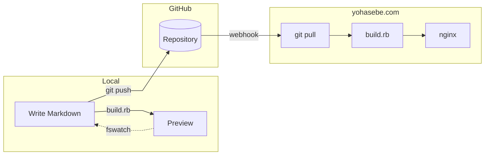

As I wrote in the [first post](../2026-01-01-hello-world/index.html), this site runs on a custom static site generator I built in Ruby. No framework -- just a single script that converts Markdown files into HTML pages. Here is how the pieces fit together.

## The workflow

I write posts in Markdown with YAML front matter. Running `build.rb serve` starts a local preview server and watches for file changes via fswatch, rebuilding automatically whenever I save.

When I push to GitHub, a webhook notifies my server, which pulls the latest changes, runs the build script, and the updated site is served by nginx. The whole process takes a few seconds.

## Tech stack

- **Markdown processing**: kramdown with GitHub Flavored Markdown, Rouge for syntax highlighting, KaTeX for math, and Mermaid for diagrams (pre-rendered to SVG at build time)
- **Image handling**: Automatic EXIF metadata stripping and responsive sizing based on intrinsic dimensions
- **Search**: Client-side full-text search using an inverted index generated at build time

The source code is in a [public GitHub repository](https://github.com/yohasebe/yohasebe.github.io). Text files in a Git repository will outlast any blogging platform.
