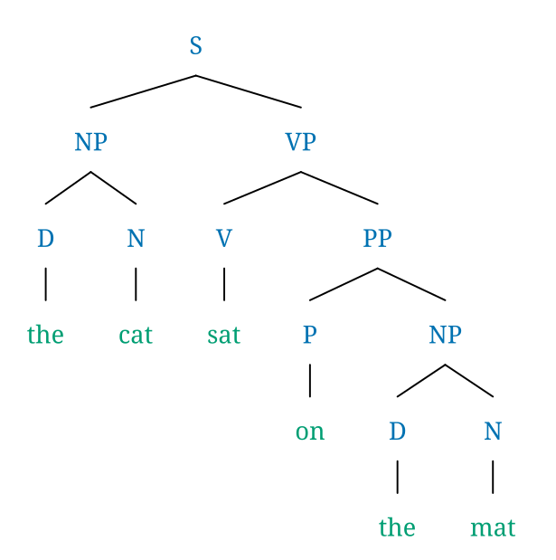
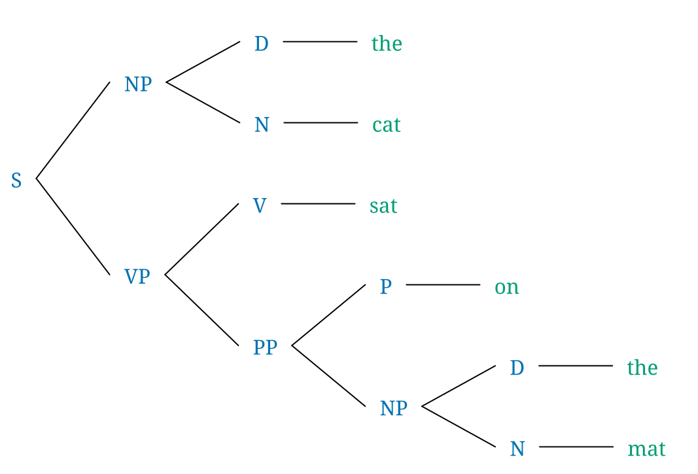
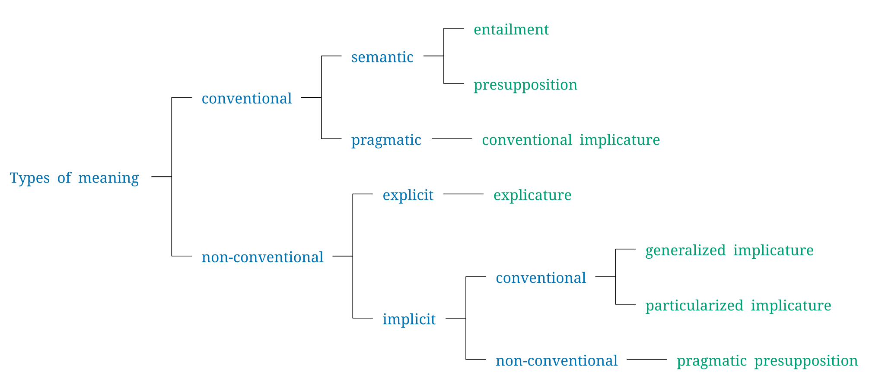

[RSyntaxTree](https://github.com/yohasebe/rsyntaxtree) 1.5 is out. The main addition is left-to-right tree layout, where the root sits on the left and leaves expand to the right.

The standard top-to-bottom layout works well for phrase structure trees in generative grammar, where the depth is moderate and the width grows with sentence length. But for classification hierarchies, taxonomies, and certain dependency structures, horizontal trees are a more natural fit. They read like an outline and make better use of screen space when the tree is deep but narrow.

Here is the same sentence tree rendered in both directions. The input is bracket notation:

```text
[S [NP [D the] [N cat]] [VP [V sat] [PP [P on] [NP [D the] [N mat]]]]]
```

First, the conventional top-to-bottom:



And the same structure laid out left-to-right with `-d ltr`:



The feature is available from the command line with the `-d ltr` flag, and via the web interface.

Where horizontal layout really shines is in classification trees. A taxonomy like the one below becomes unwieldy when drawn top-to-bottom, but reads cleanly from left to right. The `-p on` flag draws polyline connectors instead of the default diagonal lines, which suits classification diagrams better:



Internally, the tree is always computed top-to-bottom, then coordinates are transformed at the rendering stage. The same approach could support other directions. Right-to-left might be useful for visualizing structures in Arabic or Hebrew. Bottom-to-top, while rare in theoretical linguistics, could work well for phylogenetic trees in linguistics or biology. Neither is implemented yet, but both are worth considering.

Install or update: `gem install rsyntaxtree`

- [RSyntaxTree web app](https://yohasebe.com/rsyntaxtree)
- [RSyntaxTree example gallery](https://yohasebe.github.io/rsyntaxtree/examples)
- [RSyntaxTree documentation](https://yohasebe.github.io/rsyntaxtree/documentation)
