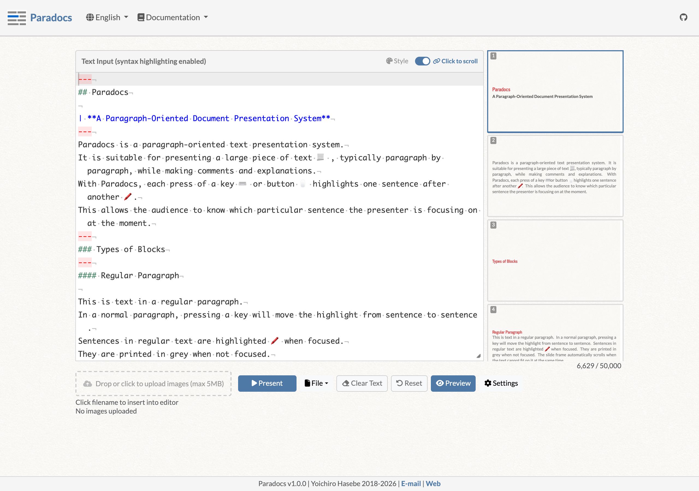
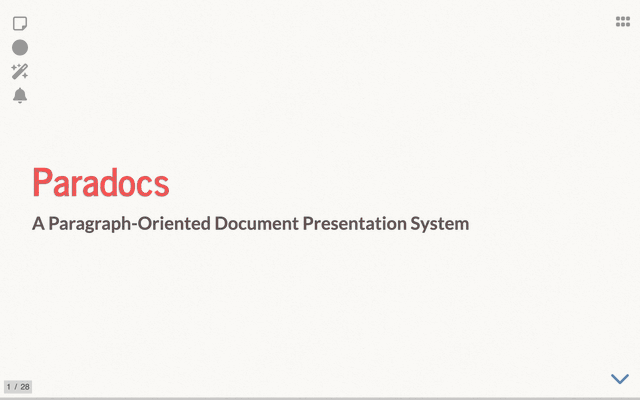

I released version 1.0 of [Paradocs](https://yohasebe.github.io/paradocs), a presentation tool. The name stands for paragraph-oriented document presentation system, reflecting its focus on handling text at the paragraph and sentence level. I originally built it in 2018 for ESL reading classes. The core feature is sentence-by-sentence highlighting as you walk through a text.

In a language class, keeping everyone on the same sentence at the same time is surprisingly hard with existing slide tools. PowerPoint and Google Slides operate at the slide level. Moving focus from one sentence to the next within a single paragraph is not something they are designed to do well. Paradocs was built to solve exactly that.

It runs entirely in the browser with no server required, hosted as a static site on GitHub Pages. Text data stays in the browser unless you opt in to cloud-based speech synthesis.

Each press of a key advances the highlight to the next sentence. Here is what it looks like in presentation mode:

With v1.0.0, the following features are now in place, marking a milestone:

- Text-to-speech. Works for free using the browser's built-in speech synthesis, with optional support for OpenAI and ElevenLabs cloud voices. Word-level highlighting during playback.
- Fill-in-the-blank and multiple-choice quizzes.
- Multilingual UI: English, Japanese, Chinese, and Korean.
- Export as a standalone HTML file for offline use.
- Live preview with filmstrip thumbnails.
- Dark mode for both the editor and the presentation.

Paradocs was made for language education, but I imagine there are other situations where stepping through text one sentence at a time is useful. If you find such a use, I would be glad to hear about it.
