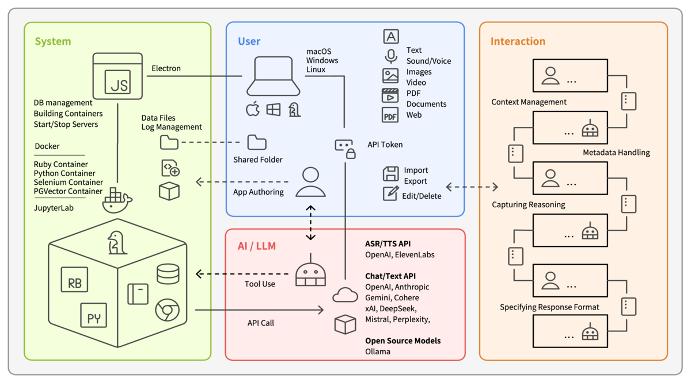

[Monadic Chat](https://github.com/yohasebe/monadic-chat) is a project I started in 2022, when the GPT-3 text completion API was the most capable thing one could call from a script. The OpenAI Chat API did not yet exist, and there was no built-in notion of conversational context. To make a chatbot that remembered what had been said, you had to manage the context yourself, on your own terms. I built Monadic Chat as one way of doing that. The name has stuck through several major rewrites, and I would like to explain where it came from -- and why it still seems to fit.

Current Monadic Chat architecture
{: .caption}

## A name from functional programming

In functional programming, a *monad* is a way of wrapping a value together with some surrounding context, such that you can keep operating on the value without having to manage the context by hand. The classic metaphor is "a value in a box": you put `a` into a box, you transform the contents of the box into `b`, and the box -- whatever it contains -- comes along for the ride.

When I was thinking about how to maintain conversational context across stateless API calls, this metaphor seemed to fit. Each user turn could be seen as a value, the conversation history as the surrounding context, and the act of producing a response as a transformation that happens *inside* that context rather than outside of it. The first version of Monadic Chat was a tiny Ruby program that did exactly this with JSON templates: each request carried an `input`, an `output`, and an `accumulator`, and the response itself became the next input. I wrote a [short paper](https://www.anlp.jp/proceedings/annual_meeting/2023/pdf_dir/Q12-9.pdf) about it for the 2023 annual meeting of the Association for Natural Language Processing.

## Discourse as monad

The reason the monad metaphor felt right was not only that it gave me a useful way to think about the software architecture. It also matched the way cognitive linguists describe what speakers and hearers actually do when they hold a conversation.

Ronald Langacker has written extensively about what he calls the *current discourse space* -- a structured representation of the immediately relevant context that participants share at any moment in a conversation. Each utterance updates this space: new entities are introduced, previous ones recede, the focus shifts, and the updated space becomes the ground for the next utterance. The structure has some parallels with how a monadic computation passes its environment forward through each step.

The monad in functional programming is a precisely defined mathematical object, while the current discourse space is a theoretical construct in cognitive linguistics. I do not want to conflate the two, but the *shape* is similar enough that bringing them into conversation seemed worthwhile. I have explored the linguistic side of this elsewhere -- in a [talk at ICLC 16 in 2023](assets/docs/iclc16-hasebe-2023.pdf) and in *Ninchi Gengogaku Ronkou* (Studies in Cognitive Linguistics) the year after, which I [introduced on this blog earlier](../2026-01-05-stack-model/index.html).

What matters, I think, is that how human speakers actually hold and manage context remains very much an open question in cognitive linguistics, and conversational AI may, perhaps, give us a new kind of object to think with -- not only as a practical tool but as something that could feed back into theoretical work on discourse and cognition.

## Where the project is going

Monadic Chat in 2026 is more eclectic than the original prototype. It speaks to multiple LLM providers, runs containerised tools, and handles images, audio, and video as well as text. It has grown into more of a multi-tool than a focused one. The [project page](https://yohasebe.github.io/monadic-chat/) has the current details.

Real discourse is typically multimodal: gesture, intonation, and the visible environment all tend to play a part in how people make meaning, even though formal linguistic theory has often lacked the tools to handle them and has tended to set them aside in analysis. Monadic Chat's handling of images, audio, and video is still only partial, but my hope is that it will become not only a chat tool that gradually grows into such material, but also a medium through which I can come to understand more concretely what context actually is, and what the current discourse space really looks like.
