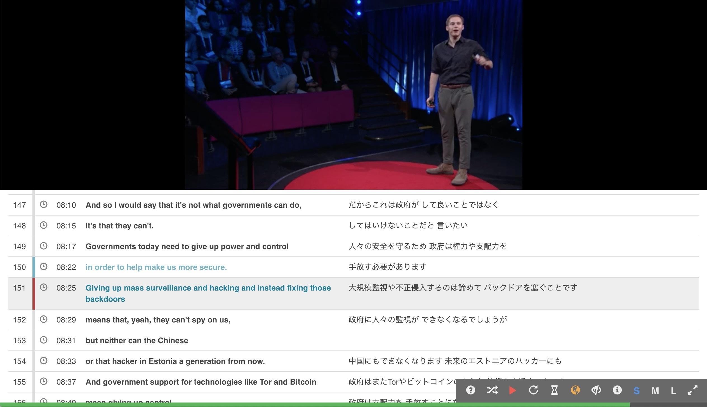
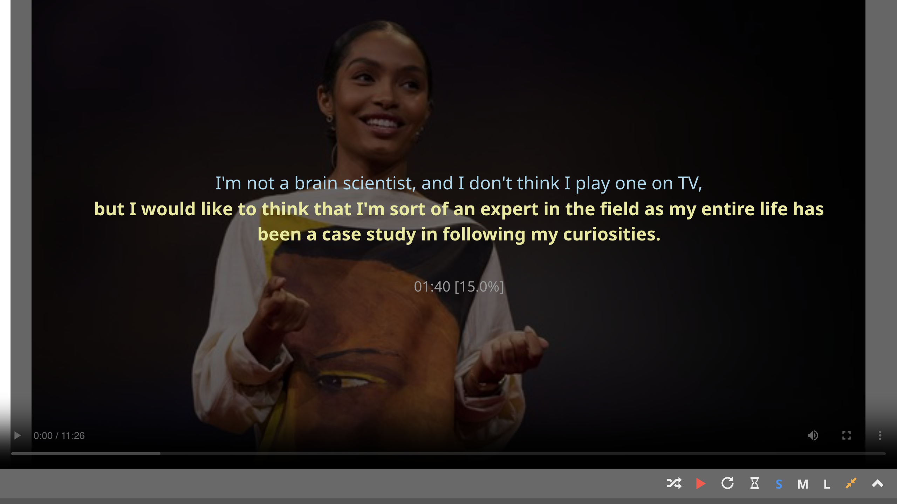

Over the past month I have written about a couple of recent changes to [TCSE](https://yohasebe.com/tcse): [entity search and the 6,400-talk milestone](../2026-03-17-tcse-update/index.html), and the [new export feature](../2026-04-11-tcse-export/index.html). This post is about the education side of the project rather than the research side -- an older, less visible feature in the video player for second-language learners who use TED talks for English listening practice.

## Normal and fullscreen viewing modes

When you play a talk in TCSE, the default view shows the video above a scrolling transcript, with translations side by side if a translation language is selected.

{: style="max-width:80%"}

Normal viewing mode
{: .caption}

Clicking the fullscreen icon at the bottom right of the player (or pressing `ESC`) switches into fullscreen mode. The transcript and translation disappear from the screen during playback. Press the spacebar to pause, and the text for the current segment appears in yellow and the previous segment in cyan, with the translation (if selected) below. Press space again to resume, and the text goes away.

{: style="max-width:80%"}

Fullscreen viewing mode (paused)
{: .caption}

A few shortcuts are useful during listening practice: `R` to repeat the current segment, `A` to toggle "Study Mode" (auto-pause at every segment boundary), and `T` to show or hide the translation. The full list is on the [shortcut keys page](https://yohasebe.github.io/tcse-doc/playing-video/player-functions-and-shortcut-keys/); the feature itself is documented under ["pause-and-check"](https://yohasebe.github.io/tcse-doc/using-tcse-for-language-learning-and-education/using-pause-and-check/).

## Why this mode exists

The design rests on a view of L2 listening practice I have held for a long time. If text is on screen the whole time, processing gets pulled toward the visual channel and the learner ends up *hearing* without really *listening*; but removing all text does not help either, since comprehension depends on context, and a learner who loses the thread early tends to spend the rest of the talk processing fragments. What is needed, and what pause-and-check tries to support, is *spot* access to the transcript -- available when the thread breaks, not otherwise. The video plays without text in the way, and a tap of the spacebar brings just enough of the transcript back (the current and previous segments) to repair comprehension before resuming.

TCSE is, at its core, a search engine for language research and teaching, and this listening mode is not central to what it does. It is not the feature I would name first if asked what TCSE is for. But it is one of my personal favorites, and I hope language learners who land on a talk through search might find it useful once they have already found what they were looking for.
