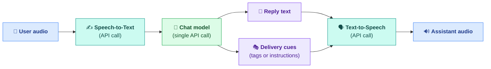

[Monadic Chat](https://yohasebe.github.io/monadic-chat/)'s voice interaction runs on a pipeline: user audio → STT → chat model → TTS → assistant audio. The new **Expressive Speech** feature uses that pipeline by having the chat model emit both the reply text and a set of delivery cues (laugh here, whisper there, sound warm throughout) in the same generation, and passing them to the TTS engine together.

In Monadic Chat's Voice Chat apps, this effectively lets the assistant act as an AI agent that also directs its own delivery -- deciding where to laugh, where to whisper, and what overall colour the voice should have, all at reply-generation time.



Monadic Chat currently supports four TTS providers for this, and their APIs fall into two broad approaches.

## Inline markers

xAI Grok, ElevenLabs v3, and Google Gemini all interpret tags embedded directly in the text. The engine consumes the bracketed tokens as stage directions instead of reading them aloud.

**xAI Grok** (model `grok-tts`, voice `ara`) is the only provider among the four that pairs point markers (`[inhale]`, `[sigh]`, `[laugh]`) with *range markers* -- opening and closing tags that apply an effect to the enclosed span and then return to normal voice. The wrapping set includes `<whisper>`, `<slow>`, `<loud>`, `<high>`, and `<sing>` ([xAI docs](https://docs.x.ai/developers/model-capabilities/audio/text-to-speech#speech-tags)).

```
[inhale] <slow>Let me think about that for a second.</slow>
<whisper>Actually, between you and me, I already know the answer.</whisper>
```

<audio controls src="xai.mp3"></audio>

**ElevenLabs v3** (model `eleven_v3`, voice `Rachel`) uses single-token square brackets for everything. The vocabulary is emotional (`[excited]`, `[curious]`, `[sad]`, `[sarcastic]`) and performative (`[sings]`, `[giggles]`, `[sobs]`) ([ElevenLabs docs](https://elevenlabs.io/docs/overview/capabilities/text-to-dialogue#emotional-deliveries-with-audio-tags)).

```
[excited] You won't believe this! [giggles] Oh my goodness.
[sings] La la la, la la la la!
```

<audio controls src="elevenlabs.mp3"></audio>

**Google Gemini** (model `gemini-2.5-flash-preview-tts`, voice `Zephyr`) uses syntax similar to ElevenLabs v3, but with a distinctive vocabulary of situational moods: `[mischievously]`, `[panicked]`, `[amazed]`, `[trembling]`, `[gasp]`, `[shouting]`, `[tired]` ([Gemini speech generation](https://ai.google.dev/gemini-api/docs/speech-generation?hl=en#audio-tags)).

```
[amazed] Look at that cake!
[mischievously] I wonder if anyone would notice a missing slice.
[panicked] Quick, someone's coming!
```

<audio controls src="gemini.mp3"></audio>

## Instructions

OpenAI's `gpt-4o-mini-tts` splits text and direction. The reply text stays clean, and a separate `instructions` parameter in the TTS API call specifies how to deliver the whole utterance. Because an instruction shapes the entire delivery rather than a moment, even a short text with a bit of emotional range is enough to hear the effect ([openai.fm](https://www.openai.fm/) is a quick playground).

Because the instruction is free-form English, it is not tied to a fixed tag vocabulary. Voice quality, emotional arc, and pacing can all be described the way a director might sketch a scene.

**OpenAI** (model `gpt-4o-mini-tts`, voice `ballad`):

```
Input:
  "Oh my goodness, you are not going to believe this!
   You know that guitar piece I've been working on for months?
   I just played it all the way through -- no mistakes, clean as
   anything! I am so happy right now, you have no idea!"

Instructions:
  Voice: bright, giddy, absolutely bursting with joy.
  Tone: pure, uncontainable excitement from start to finish; each
        sentence should sound like it's barely holding the happiness in.
  Pacing: quick and breathless; strong emphasis on "no mistakes" and
          "so happy"; a triumphant beat on "clean as anything".
  Emotion: unfiltered delight and pride; the voice should practically
           glow.
  Delivery: a small laugh or giggle of disbelief should slip through
            after "all the way through"; the voice climbs in intensity
            toward the final line.
```

<audio controls src="openai.mp3"></audio>

One thing worth noting: with OpenAI, the choice of voice makes a surprising difference to how instructions land. Neutral voices like `alloy` respond less dramatically, while `coral` and `ballad` pick up expressive directives much more readily. The sample above uses `ballad`.

Gemini also accepts natural-language direction placed at the front of the prompt, in addition to the tag-based approach seen earlier. Tags and directive can even be combined in a single prompt -- the directive shapes the overall atmosphere while the tags pin down specific moments.

**Google Gemini** (model `gemini-2.5-flash-preview-tts`, voice `Zephyr`) in hybrid form (same utterance as the OpenAI sample above, delivered with a directive plus inline tags):

```
Input:
  "Say with this voice and style:
   Voice: bright, giddy, absolutely bursting with joy.
   Tone: pure, uncontainable excitement from start to finish.
   Pacing: quick and breathless; strong emphasis on 'no mistakes' and 'so happy'.
   Emotion: unfiltered delight and pride.

   Oh my goodness, you are not going to believe this! [giggles]
   You know that guitar piece I've been working on for months?
   I just played it all the way through -- no mistakes, clean as anything!
   [laughs] I am so happy right now, you have no idea!"
```

<audio controls src="gemini-instruction.mp3"></audio>

Fully model-native realtime voice APIs -- OpenAI Realtime, Gemini Live, and similar -- respond with lower latency and a more natural turn-taking rhythm, but they fold content, voice, and timing into a single model that the application cannot easily redirect. Monadic Chat's pipeline keeps the chat model and the TTS engine as separate stages, so any chat provider can be paired with any TTS provider, and the model -- acting as an agent -- can shape the content and its delivery in the same reply. The trade-off is immediacy for directorial control.
