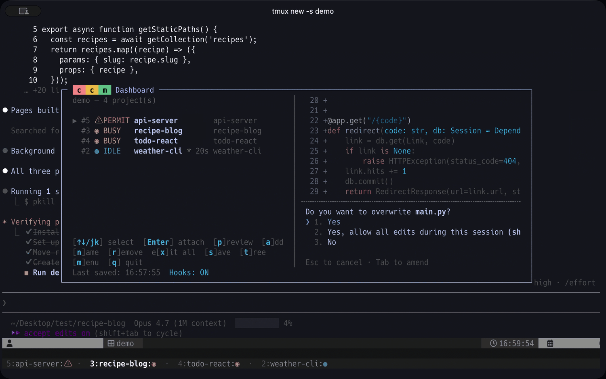

When you run Claude Code for one project at a time, switching contexts feels manageable. You wait for it to finish, you respond, you move on. Push that up to four or five projects in parallel and the picture changes. The compute is no longer the bottleneck. Your attention is.

I have been building [ccm for tmux](https://github.com/yohasebe/tmux-ccm) as an answer to this. It does several things now, but the pieces that defined the project from the start trace back to a single question: *which window should I be looking at right now?*

## The mental model

ccm assigns each project to its own tmux window. The window can hold Claude Code alongside a shell, a dev server, or any other long-running process. The state of the Claude Code pane (PERMIT, BUSY, IDLE) propagates up to the window itself, and ccm lets you move between windows with `prefix + Tab`.

## States that map to urgency

Each Claude Code session moves through phases. It is reasoning or producing output (BUSY). It pauses to ask permission before taking some action (PERMIT). It finishes and waits for the next prompt (IDLE). Or no Claude Code session is running in the window (SHELL). ccm reads each tmux pane's contents in the background and tags the window with one of these states.

The four states sort cleanly by urgency:

> PERMIT > BUSY > IDLE > SHELL

PERMIT is the most demanding: a session has presented options and is waiting for you. Miss it and the session sits frozen. BUSY is next -- a session is producing output that you may want to follow or course-correct. IDLE is comfortable: the session has done what was asked, and there is no pressure. SHELL is the lowest priority; no session is running, so nothing needs you unless you decide to start one.

ccm also moves windows to SHELL on its own. A session that has been idle for a while is auto-exited to free memory and CPU, then restarted with `--continue` (resuming the previous context) when you switch back. The state ordering is what the dashboard surfaces:

PERMIT rows land at the top regardless of original window order; the eye moves down from there. Switching to a project becomes a single keystroke once the decision is made.

## Coordination across projects

A second feature applies the same state model across projects. `ccm send <project> <message>` queues a prompt into another project's session, with safety gating based on the target's current state. PERMIT-state windows are refused unconditionally -- typing into a permission dialog could accidentally approve or reject a tool call. BUSY-state targets need explicit `--force` (the input is queued rather than mixed mid-turn). SHELL-state windows can auto-start Claude Code first.

This turns inter-project coordination into something close to message passing. The session in project A can -- through me, as the human in the loop -- ask the session in project B about its current state, share findings, request follow-up work. The same states that organize my attention also gate what flows between projects.

## With Agent Teams

Once `ccm send` makes inter-project coordination routine, a natural next question follows: could the coordination itself be delegated to AI? Within a single project, Claude Code already does this through [Agent Teams](https://code.claude.com/docs/en/agent-teams), where one session coordinates teammates running in parallel panes within a single window (tmux or iTerm2).

Because the two structures (panes within a window, windows across a session) do not overlap, they compose naturally. A ccm-managed window can host an Agent Team, and ccm aggregates state across the team's panes using the same priority order. If any teammate is at PERMIT, the whole window appears as PERMIT in the dashboard -- so a single agent waiting for permission surfaces immediately even when focus is on a different teammate, and the human-side question stays the same: which window should I be looking at right now?

## Attention as the human-AI interface

The opening observation -- attention, not compute, is the bottleneck -- seems to sharpen as more work moves to agents. Attention may be one of the places where humans and AI still meet, with the human role on that surface narrowing toward what to bring forward, what to ignore, when to interrupt. ccm is a small piece of that surface, and the rest is something I want to keep thinking about.
