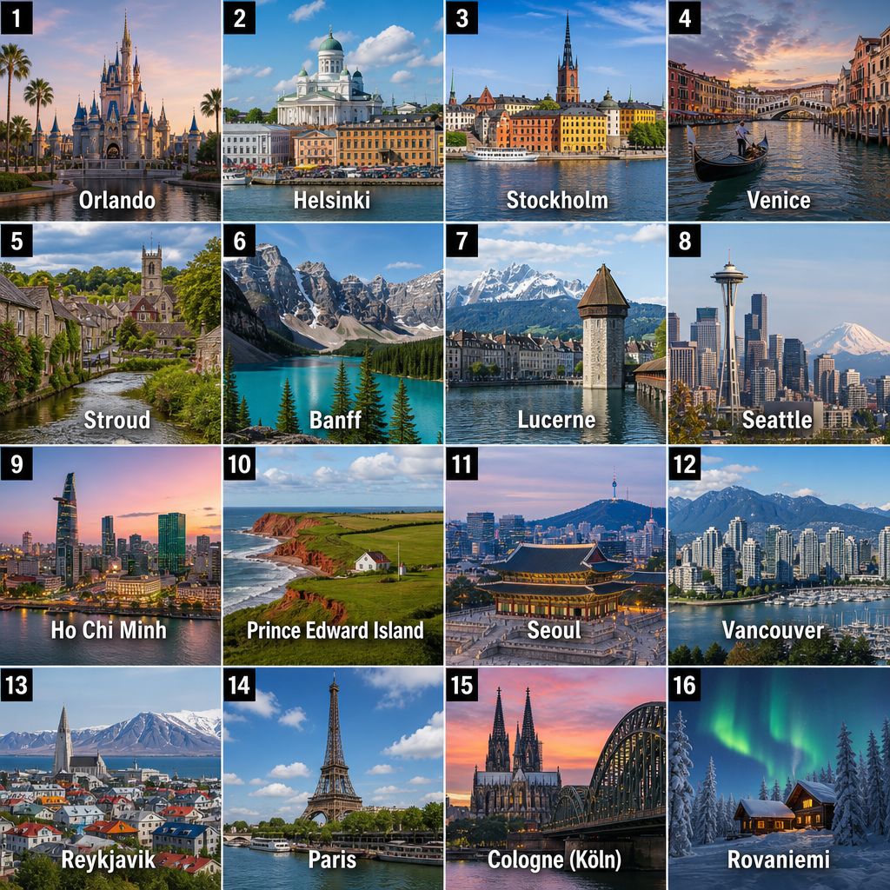

At my institution I teach several first-year English communication courses for students from a range of faculties. In several of them, [Monadic Chat](https://github.com/yohasebe/monadic-chat) has come to play something like an assistant-teacher role. Voice conversations with students, on-the-fly vocabulary or idiom examples, cultural commentary on items that come up in reading materials. The teacher's moderation remains essential, but recent high-end LLMs have the capability needed for this kind of use.

One format I have been running lately, with groups of 15 to 20 students, is short one-minute English talks on a given theme. "A foreign city I would like to visit." "The greatest invention or discovery in human history." Themes broad enough that each student can choose something personal, specific enough that they have something to say.

Some kind of visual aid usually makes these sessions more engaging. But the talks happen one at a time, students pick their own topics, and I do not know what all of them are until they speak. There is no preparing a slide deck in advance.

Monadic Chat's Image Generator, backed by OpenAI's `gpt-image-2`, solves this. A prompt like:

> Create a matrix-style image of the following N items, with numbered labels.

together with the list of student topics produces a single grid image on the spot, which I project on the classroom screen as the talks proceed.

Theme: "The greatest invention or discovery in human history."
{:.caption}

Theme: "A foreign city I would like to visit."
{:.caption}

ChatGPT or Gemini can do this just as well, and plenty of teachers already work this way. The shape of classroom teaching is certainly shifting.
