I recently added an app to [Monadic Chat](https://github.com/yohasebe/monadic-chat) called **Music Analyst**. It runs two tools over an uploaded recording and keeps their results apart: a quantitative analysis and a qualitative evaluation.

- **Quantitative analysis** (`analyze_audio_features`): a Python pipeline using [librosa](https://librosa.org/) and [madmom](https://github.com/CPJKU/madmom) measures duration, tempo, key, time signature, chord progression, and sections. These are numbers, computed from the signal.
- **Qualitative evaluation** (`critique_audio`): the same audio goes to Gemini's audio-understanding endpoint for a critique: character and mood, genre, instrumentation, and performance qualities like expression, phrasing, dynamics, and timing.

The qualitative side rests on a documented capability: among the use cases Gemini's [audio documentation](https://ai.google.dev/gemini-api/docs/audio) lists is to "Detect emotion in speech and music." The recording I use to show it is my own playing, a rough solo from [a cover session](../2026-03-15-cover-session-spring/index.html), included so the feature comes with audio you can actually hear. Please excuse the rough playing.

### How it fits together

A chat model, the orchestration agent, receives the upload and, for a normal analysis, runs both tools. The two are different in kind: `analyze_audio_features` is a deterministic Python step, not a language model, while `critique_audio` is a separate Gemini call that receives only the audio. It does not see the measured numbers, so its impressions come from the sound rather than from the quantitative output. Both results return to the orchestration agent, which assembles the reply.

The qualitative prompt is kept within what the model can actually support: it does not judge audio fidelity, mix, or stereo image (per the same documentation, Gemini folds multi-channel audio down to a single channel and downsamples it), it leaves exact tempo and key to the quantitative tool, and it names only instruments it can hear, treating genre as a tentative guess rather than a firm label.

### Trying it on a recording

I ran it with almost no context attached. No song title, no artist, no genre:

> Please analyze solo-sample.mp3. It is a short electric-guitar solo I recorded in a session with friends. Run both of your analyses on it: first the quantitative, measured features (tempo, key, time signature, chord progression), then a qualitative evaluation of the performance, focusing on the lead guitar's expression, phrasing, and timing/groove. Please identify the genre/style and instrumentation you hear as part of the evaluation, and present the quantitative features and the qualitative evaluation as clearly separated sections.

The recording:

<audio controls src="solo-sample.mp3" style="width:100%"></audio>

### Quantitative features

- **Duration:** 0:36
- **Tempo:** 73.8 BPM
- **Key:** E minor
- **Time signature:** 4/4
- **Chord progression:** centered on E minor (Em, C, G, Am, with a passing D# and A)

The tempo and key match the recording. Because this is signal processing rather than judgement, the numbers are basically the same on every run.

### Qualitative evaluation

This is Gemini's qualitative evaluation, formed from the audio. Here are excerpts from the report:

**Genre, style, and instrumentation**

> The critique hears the track leaning strongly toward a high-energy style of hard rock, perhaps drawing heavily from late-1960s or 70s psychedelic rock, blues-rock, or early heavy metal. The instrumentation appears to be a classic power-trio lineup: an overdriven, highly sustaining electric lead guitar as the primary voice; a driving bass guitar providing low-end propulsion; a steady, fast-paced drum kit keeping a relentless, straight-ahead rock beat.

**Expression**

> The guitarist's expressive vocabulary is highly physical and deeply vocal. The critique notes a rich use of wide, aggressive vibrato, dramatic pitch bends, and slides that give the guitar a singing, almost human quality. The sharp, dig-in pick attack drives the amplifier into a rich saturation, creating a raw, tactile connection that makes every note feel urgent and deeply felt.

**Phrasing**

> The phrasing operates on a tension-and-release dynamic using familiar blues-scale and pentatonic frameworks. The performance contrasts long, soaring sustained notes with rapid, explosive flurries of ornamentation. It has a spontaneous, improvisational feel, though the critique notes that the phrasing sometimes leans heavily on continuous, busy activity, leaving little room for silence or breath.

**Timing and groove**

> Set against a driving rhythm section, the lead guitar rides on top of the beat with a highly pushy, forward-leaning attitude. While this adds frantic, exciting energy, it also presents a challenge: during the faster, subdivided runs, the guitarist has a tendency to rush, momentarily crowding the pocket and pulling slightly ahead of the drummer's steady groove.

### How far to trust it

That the quantitative analysis is deterministic does not make it correct: it returns the same values for the same input, but it can still mis-read; chord detection in particular sometimes mistakes the harmony. The qualitative evaluation is shakier: it runs only on Gemini for now, and depending on how the prompt is built it can name an instrument that is not in the recording. In earlier iterations, before I added those constraints to the prompt, the qualitative tool sometimes mentioned a rhythm guitar that was not actually on the track. The performance may not be quite sufficient yet. Still, as better models arrive, having AI evaluate recorded music like this should become a realistic and genuinely useful practice.
