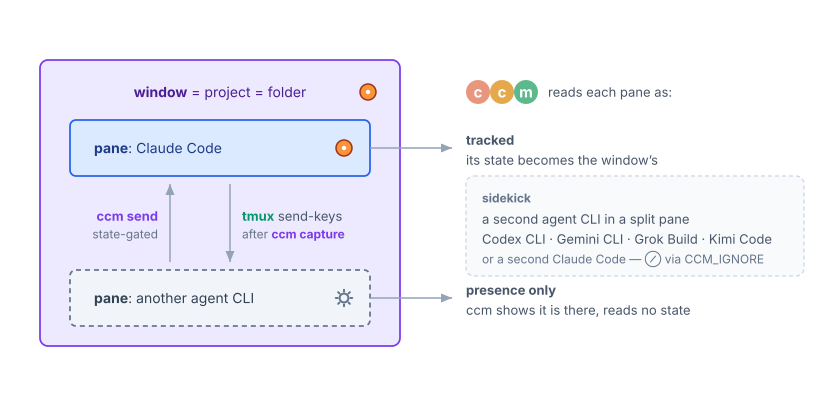

In [an earlier post](../2026-05-04-ccm-attention-manager/index.html) I introduced [ccm](https://github.com/yohasebe/tmux-ccm), a tmux plugin that works as an attention manager for people who run Claude Code across several projects in parallel. The recent v0.7.0 and v0.8.0 releases added support for a *sidekick*: a second agent CLI running in a split pane right next to the main session.

The main pane runs Claude Code on the project as usual. The split pane runs another agent: a coding agent from another vendor (Codex, Gemini, Grok, Kimi, and so on), or a second Claude Code. Either way, each agent gets a role. For example:

- **Reviewer.** Before committing to a design, have the model next door read it.
- **Implementer.** One agent writes the design and reviews the result; the other does the implementation.
- **Editor.** One agent writes a document, the other edits it, and the draft passes back and forth between them.

Sidekick support consists of two pieces.

The first is a way to tell ccm about the sidekick. ccm tracks one Claude Code session per project window, as before, and the second pane can now be declared a sidekick: the window's state continues to reflect the main session alone, while the sidekick shows up as present, deliberately left outside the tracking.

The second is a direct line between the two agents. How to deliver a message to the other side is decided in advance, so the agents can talk to each other without a human copying text between panes. A message to the main session never lands in a permission dialog; in the other direction, the sender first checks that the peer is ready. Neither side has to keep watching the other: when an agent finishes a request, it reports back, and the reply arrives as a normal conversational turn. The details are in the [documentation](https://github.com/yohasebe/tmux-ccm/blob/HEAD/docs/guide.md#relaying-with-a-second-agent-cli).

None of this depends on the peer being a particular product. The conventions are plain tmux and plain text, so any CLI that can run a shell command -- Codex CLI, Gemini CLI, Grok Build, Kimi Code, among others -- can participate.

Agent-to-agent support is already being tried in many forms, and I expect it to matter more and more. First-party apps from each provider know their own models and APIs well and are highly capable, but they tend to be less eager about working with other providers' models. For the time being, this looks like a place where open-source tools can be of use.
