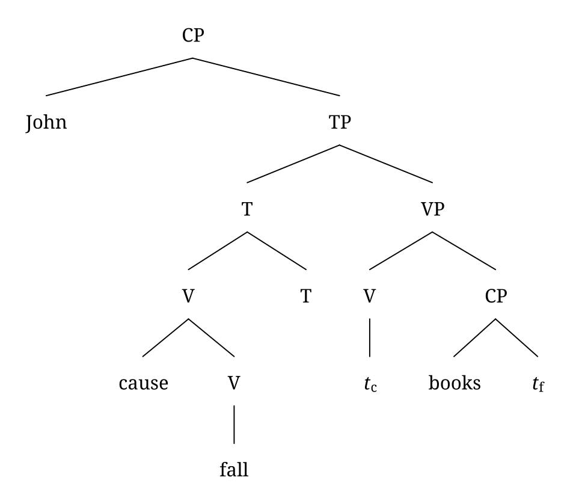
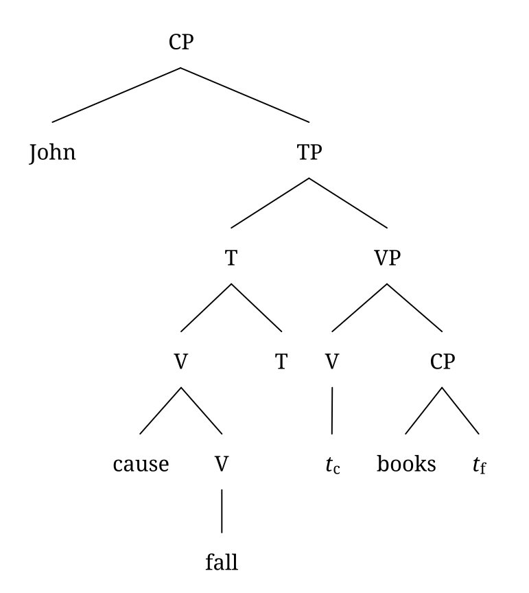
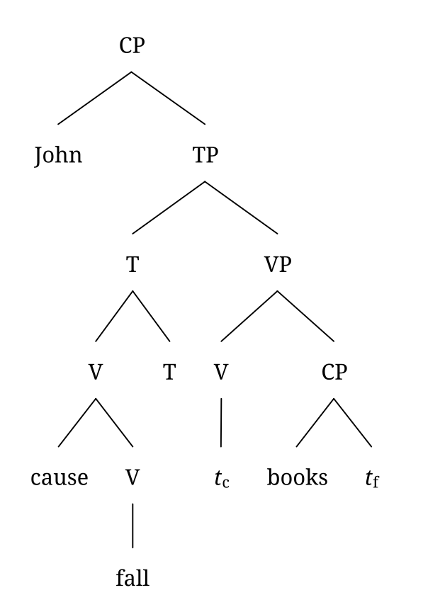
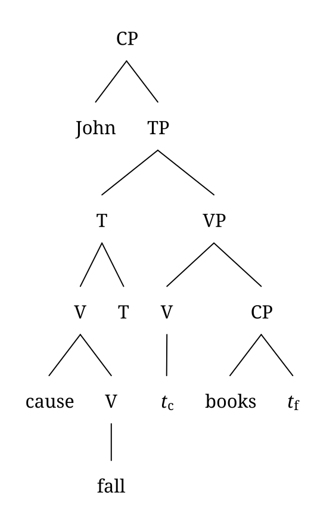

I released [RSyntaxTree](https://yohasebe.com/rsyntaxtree) 1.8. One of the additions is `tidy`, a setting that controls how tightly subtrees are packed.

Until now, every subtree was given a horizontal slot wide enough that it could never meet its neighbours. That is simple and always works, but much of the reserved space goes unused. Each embedded phrase pushes its siblings apart, and trees nest deeply, so even a small structure can come out wider than it needs to be. Here is one from Chomsky (1995: 50), drawn the old way:

tidy off — 969 px

Tidy layout measures the actual shape of each subtree and slides neighbours together until they almost touch. There are three levels of packing, drawn here at the same scale as the tree above:

tidy low — 772 px

tidy medium — 597 px

tidy high — 565 px

The levels differ in how far a subtree may slide under its neighbours. `low` never lets two words overlap horizontally, so no word ends up directly above or below another. `medium` allows it, and that is what narrows the tree: above, *John* and *cause* have ended up one above the other. Neither may pass the other, so the words keep their left-to-right order. `high` keeps that order only within a row, and it gives up one more rule the lower levels hold to: that a pair of branches is never packed tighter than the pair below it. That rule is what keeps branch angles similar from one level to the next, and dropping it is what lets `high` go narrower still.

How much any of this helps depends on the tree. A balanced tree has little space to recover; a deep branch beside a shallow one has a lot. For this tree I would use `medium`. `high` takes another 5% off the width, but its angles are visibly less even, which is a poor trade at this size; it earns its place on trees that really are too wide to print.

The other main improvement in this release is multilingual rendering. Every font style now falls back to Noto Sans/Serif/Mono CJK, so Hangul and both simplified and traditional Han render in all of them, and Arabic, Hebrew, Devanagari, Thai and Khmer are named explicitly in the font chains. Machines that have those fonts installed now produce the same shapes from the same input. A new `mirror` option flips a finished tree horizontally, for the right-to-left convention used in Arabic and Hebrew. The [example gallery](https://yohasebe.github.io/rsyntaxtree/examples) has a multilingual section showing the same sentence in nine languages, and each example now lists the settings used, so it can be reproduced in the web interface.

---

Chomsky, Noam. 1995. *The Minimalist Program*. Cambridge, MA: MIT Press.
