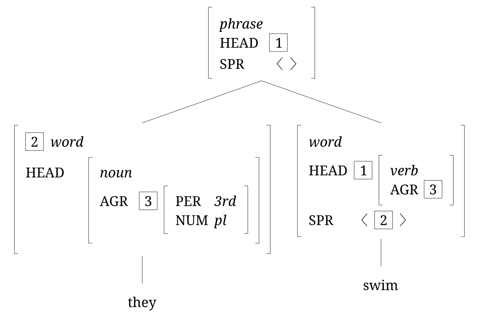
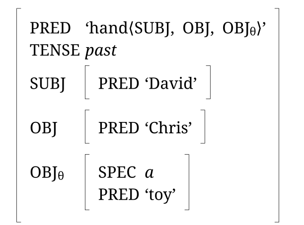

[RSyntaxTree](https://yohasebe.com/rsyntaxtree) has had a series of releases since [the tidy layout post](../2026-08-15-rsyntaxtree-tidy/index.html). The largest addition is support for attribute-value matrices (AVMs), the notation that HPSG and LFG are written in. A label can be cut into aligned columns, the value of an attribute can be another matrix nested to any depth, and a matrix can sit at any node of an ordinary tree.

Here is *They swim*, the sentence Sag, Wasow and Bender (2003: ch. 3) use for the first worked example of their feature-structure grammar, drawn with the detail cut down to what the picture needs:

{:.scale-group-avm}

<details markdown="1">
<summary>Input</summary>

```
[#*phrase*\
  HEAD\t|1|\
  SPR\t〈<>〉
  [#|2|<>*word*\
    HEAD\t#(*noun*\
    AGR\t|3|<>#(PER\t*3rd*\
    NUM\t*pl*#)#)
    they
  ]
  [#*word*\
    HEAD\t|1|<>#(*verb*\
    AGR\t|3|#)\
    SPR\t〈<>|2|<>〉
    swim
  ]
]
```

</details>

Each node is a matrix: a type in italics, then attributes and their values. A value can itself be a matrix. The HEAD of *they* is a *noun* object carrying an agreement matrix inside it. The boxed numerals mark structure sharing, two places in the description holding one value. Tag 1 says the HEAD of the phrase is the HEAD of the verb. Tag 2 says the item the verb's SPR (specifier) list asks for is the subject word itself. Tag 3 says the noun's agreement features and the verb's are the same thing.

A label can also be nothing but a matrix, with no tree around it. This is the f-structure of *David handed Chris a toy*, after Bresnan (2001):

{:.scale-group-avm}

<details markdown="1">
<summary>Input</summary>

```
[#PRED\t‘hand⟨SUBJ,<>OBJ,<>OBJ_θ_⟩’\
  TENSE\t*past*\
  SUBJ\t#(PRED\t‘David’#)\
  OBJ\t#(PRED\t‘Chris’#)\
  OBJ_θ_\t#(SPEC\t*a*\
  PRED\t‘toy’#)
]
```

</details>

Diagrams of this kind are usually prepared in LaTeX with packages like avm or langsci-avm. RSyntaxTree draws them from the same short bracket notation it uses for trees, in the browser, with SVG, PNG and PDF output. The notation is described in the [documentation](https://yohasebe.github.io/rsyntaxtree/documentation), and the [example gallery](https://yohasebe.github.io/rsyntaxtree/examples) has figures for HPSG and LFG, each listing the input and settings it was drawn from.

---

Bresnan, Joan. 2001. *Lexical-Functional Syntax*. Oxford: Blackwell.

Sag, Ivan A., Thomas Wasow, and Emily M. Bender. 2003. *Syntactic Theory: A Formal Introduction*. 2nd ed. Stanford: CSLI Publications.
